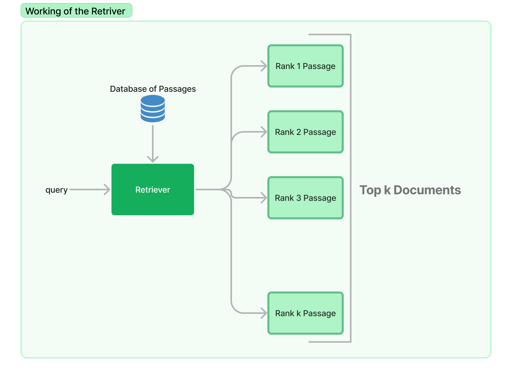
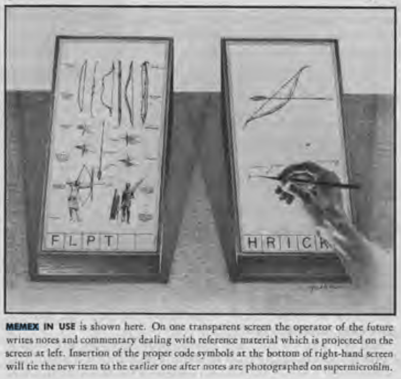

# A Brief History of Information Retrieval

So before studying what Colbert it might be a good idea to learn what it is that Colbert or any other model of that category does. Colbert is a type of **Retriever Model.** These are models that are *designed* to find and **retrieve** the most relevant documents from a large collection or database of documents given a specific query.

For example, if you ask the question "What is the meaning of life?", the retriever model will search through its database of documents looking for ones that are most relevant to answering that question. It will rank the documents based on how well they match the query using a scoring function.

  

This domain of finding documents or any information in documents is called **Information Retrieval**. We'll be studying a subset of it that is concerned with retrievers. But if you think about it you're already familiar with this, I mean you and I and everyone around have been doing this for our whole life. Let's understand.

## I am a Retriever and So are you

We humans and animals too have been retrieving stuff for our whole life!! Heck I was doing it this morning trying to find my T-shirt for the gym, no I did not find it. So, I asked my mother where it was and she fetched me that shirt based on 2 information I provided her: Gym and T-Shirt.

Based on this info she reduced the scope of her search to only a few relevant places and found it! Guess that makes her a better retriever than me but do you understand? We are constantly processing information and when the need arises we are retrieving it to do a certain task. Let's take an even more primitive example.

In the past cavemen would search specific parts of the forest to search for specific ingredients and specific foods. I mean we've been processing information and retrieving it since the dawn of humanity. Even animals do it!! So in a way, I'm a retriever and so are you.

  

But the issue is we suffer from loss of parts of memory so unethical and high latency issues aside we can't have a human remember 1 million documents and retrieve/rank the relevant ones based on the query. That's why we leverage machines to do this job. But how did this all start? Let's learn.

## Pre Computer Retrievers

The earliest records of large-scale non-human retrieval go back to Libraries or more specifically the invention of the Dewey Decimal System. In 1976, a librarian named Melvil Dewey invented this system of organizing books in the library. Why was this such a big deal?

You see during those days books were arranged either alphabetically or by height in a haphazard manner, making it difficult for people to find specific books. The Dewey categorizes books based on subject, then subdivides these categories into divisions based on more specific topics, and assigns a unique numerical code called **call number** to each book.

  

Call number is kinda like the oldest version of UUID, but you understand now that even before computers arrived we have been trying to improve the retrieval experience which in this case is book retrieval.

## Computers for Retrieval

While Dewey Decimal System did make it easier to track there is still a lot of memory bound work still needed. However things got interesting when the first time a concept of *"Machine for Document Interaction"* came to the mind of **Vannevar Bush** and hence **Memex(Memory Extender)** was born in his seminal 1945 essay ["As We May Think"](http://worrydream.com/refs/Bush%20-%20As%20We%20May%20Think%20(Life%20Magazine%209-10-1945).pdf).

Memex is a hypothetical machine that would allow users to store, review, and link together a vast collection of documents, books, etc. It was designed to mimic the associative processes of the human mind, enabling users to navigate through large volumes of information efficiently and intuitively. However this never really came into existence but this was the first time someone thought of leveraging machines for "retrieval".

  

In 1960s the was a significant advancement in the development of foundational IR models. This is when Boolean model came into picture. This model allowed users to construct queries using Boolean operators (AND, OR, NOT) to express the logical relationships between terms. This approach enabled precise control over the search process, though it required users to have a clear understanding of their search criteria and the ability to construct complex queries.

## Early IR Systems

In 1960s, SMART was developed by Gerard Salton and his team at Cornell University. They was one of the first to implement the concept of TF-IDF, which became one of the first sophisticated algorithm to represent sentences as **sparse** vectors. We'll learn later what these are.

\\[ TF(t, d) = \frac{\text{Number of times term } t \text{ appears in document } d}{\text{Total number of terms in document } d} \\]

\\[ IDF(t, D) = \log \left( \frac{\text{Total number of documents in } D}{\text{Number of documents containing term } t} \right) \\]

\\[ TF-IDF(t, d, D) = \text{TF}(t, d) \times \text{IDF}(t, D) \\]

Later on, the vector space model was introduced, allowing documents and queries to be represented as vectors in a multi-dimensional space, enabling ranking based on cosine similarity. Alongside this, probabilistic retrieval models were also developed, focusing on the likelihood that a document would be relevant to a user's query.

Things were looking good with vector space models but there were issues with these models:

* Representation documents in a high-dimensional space lead to very sparse and high-dimensional vectors, especially in large datasets with extensive vocabularies, which can be computationally expensive to manage and process.
    
* Assumed that terms are independent of each other, ignoring the context and semantic relationships between words.
    
* Focuses on the presence and frequency of terms but does not capture the meaning of the text.
    
* In its simplest form, VSM does not account for the varying degrees of relevance that different documents might have with respect to a query, treating term presence in a somewhat binary manner through term weighting schemes like TF-IDF, without capturing the full essence of relevance.
    

## Internet and IR

With the introduction of the internet the way we stored and accessed data changed quickly. We went from local data search to global data search. During this time, not only did the amount of information available vastly increase but it also introduced new challenges and opportunities for searching and retrieving information from a growing Internet.

It all started with the coming of the *first search engine* **Archie** in 1990 created by Alan Emtage. I was used for indexing FTP archives, allowing people to find specific files. Along with this search engines like **Veronica(1991)** and **Jughead(1992)** also came into the picture to serve Gopher protocol unlike FTP like Archie did.

When World Wide Web came that's when things got even better with the introduction of web search engines:

* **Aliweb(1993)**: Stands for "Archie Like Indexing for the Web". It was one of the first search engines for the WWW, but it required webmasters to submit their pages for indexing which lead to limited content coverage.
    
* **WebCrawler(1994)**: WebCrawler, developed by Brian Pinkerton, was the first search engine to index entire pages, making it possible for users to search for any word on a web page, which was a pretty big deal at the time.
    
* **Yahoo! (1994)**: Initially started as a directory by Jerry Yang and David Filo, Yahoo! evolved into a major portal offering search capabilities, but it relied on human-edited directories before shifting towards crawler-based listings in the early 2000s.
    
* **AltaVista (1995)**: AltaVista became one of the most popular search engines offering fast, relevant search results and pioneering advanced search techniques, including natural language queries.
    
* **Google (1998)**: Google introduced the PageRank algorithm, which improved search by ranking web pages using paired ranking and graph metrics. It uses anchor text to assign semantic context and the relationship between linked sites and their topics.
    
Later on, search engines started becoming a part of the products themselves! Now companies like Amazon, Twitter, etc. started including the search for product/information discovery via search queries. However, these semantic search capabilities became accessible and better with the arrival of ML/DL into IR.

## Modern Approach to IR
