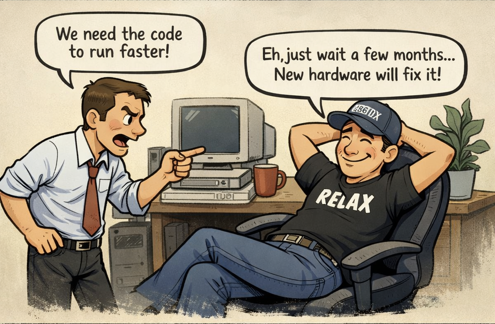

> *You’re absolutely right. I can’t execute anything fast alone.*
>
> *Everyone has their flaws & imperfections, but that’s what drives us to work together*
> 
> *To make up for those flaws. Together, we complete the job faster.*
> 
> \- **Gintoki Sakata, Gintama**

Parallelism is kinda like that too, bunch of worker doing there work in chunks and if needed accumulating the results to get the final answer. Wasn't always like this though. Anyways, AI is everywhere these days and there are people who build AI and people who build with AI. At the heart of it both aim for the same thing, building better and **faster** systems.

Making better systems, task metric wise, is a matter of research(build-evaluate-improve) but building a faster system like faster training loops or faster inference pipelines is a matter of engineering. More specifically, for faster systems you can either build a faster algorithm, like Flash Attention, or you can build better hardware that optimizes for speed of execution, like AI Accelerators. This blog focuses on the former, we'll see how we can make algorithms faster and how each of them works on hardware level i.e. CPUs.

In up coming blogs we'll talk about the latter, more specifically looking at the working of AI accelerator chips like LPUs, GPUs, TPUs, WSE-3 etc. But before all that let's under how execution/computation happens and how we can make it faster on software level!

## Single Thread Execution

### What are we executing?

Whenever we talk about execution we usually mean execution of a **program**. What is a program though? It's quite literally a *set of executable instructions*, for example when you write a code in C you compile it to a binary which literally long list of assembly instructions in binary format. 

So, when you write something innocent like this:
```c
#include <stdio.h>

int main() {
    int a = 5;
    int b = 7;
    int c = a + b;

    printf("c = %d\n", c);
    return 0;
}
```
your CPU is running a sequence like this:
```
0000000100000f50        pushq   %rbp
0000000100000f51        movq    %rsp, %rbp
0000000100000f54        subq    $0x10, %rsp
0000000100000f58        movl    $0x0, -0x4(%rbp)
0000000100000f5f        movl    $0x5, -0x8(%rbp)
0000000100000f66        movl    $0x7, -0xc(%rbp)
0000000100000f6d        movl    -0x8(%rbp), %eax
0000000100000f70        addl    -0xc(%rbp), %eax
0000000100000f73        movl    %eax, -0x10(%rbp)
0000000100000f76        leaq    0x15(%rip), %rdi
0000000100000f7d        movb    $0x0, %al
0000000100000f7f        callq   0x100000f8c
0000000100000f84        xorl    %eax, %eax
0000000100000f86        addq    $0x10, %rsp
0000000100000f8a        popq    %rbp
0000000100000f8b        retq
```

The speed at which this program will be executed depends on how fast your CPU works. Usually, this measured by the clock frequency of the CPU. Clock frequency tells you how many cycles occur per second. The number of instructions per second depends on how many instructions the CPU can do per cycle.

> *...the Kaby Lake counterparts can achieve 4.9GHz...*

It basically means Intel's Kaby Lake makes `4.9e9` cycles per second. Higher the clock frequency faster the execution. During execution the program is loaded on main memory, like RAM, CPU gets this executed and that's usually the end of story. The code we saw above compiles to roughly 15 assembly instructions. 

For simplicity, let's assume each instruction takes ~1 cycle. In reality, modern CPUs can execute multiple instructions per cycle, and some instructions take longer depending on their latency and dependencies. With only ~15 instructions, the execution time is effectively negligible, on the order of a few nanoseconds.

> [!IDEA] CISC and RISC Instruction sets
> ISC hai toh RISC hai

### How CPU executes program?

When you start the execution the instructions are loaded onto the main memory, these instruction need to be executed in an order so from here CPU fetches the instruction the needs to run and it executes it.


Going more in depth, in the CPU core there is a dedicated **Instruction Processor** that handles finding what instruction to execute and decode which component(ALUs, registers, etc.) will handle this. Then that component executes it.


This **Instruction Processor** is more formally known as **Control Unit**. Fetching and decoding is one job of the Control Unit, it also takes the decoded command and passes it to the right hardware block. If it’s arithmetic, it’ll go to an **Arithmetic Logic Unit (ALU)**. This is where the actual math happens: addition, subtraction, comparisons, bitwise operations. For more complex operations, like floating point multiplication, the CPU calls upon the **Floating Point Unit (FPU)**, which specializes in handling decimal numbers.


Let's say the instruction fetched is: `addl    -0xc(%rbp), %eax`. The ALU(our execution engine) fetches the current values from registers: `%rbp` and `%eax` from the thread *execution state*. That’s a single instruction done, often in just one or a few cycles. Meanwhile, the **control logic** already begins fetching the next instruction, ensuring the core never sits idle.  

The *execution state* of the thread is stored in registers which are small but crazy fast ephemeral storage. Aside from this you have cache hierarchies that CPU manages to "save" the data so it can be fetched quickly. Why bother with different cache and memory hierarchy? If you are interested you can read the following blob.

> [!IDEA] Working and Need of Caches
> This is a summary using the `IDEA` callout!


It starts by **fetching** the next instruction, pulling it from memory (likely from a small but incredibly quick instruction cache). Once fetched, it **decodes** it i.e. the CPU’s logic interprets what that instruction means: maybe it’s an addition, a comparison, or a write to memory. Finally, it **executes** the operation, carrying it out on the data stored in its tiny working memory called *registers*.

> [!IDEA] How do you pass the signal/data around?
> Buses

So that's how execution happens, but how do you make it fast? Two words, Clock...Frequency.

### Making Execution go brrr

The most straightforward way to make a program run faster is to make the CPU itself run faster. Since everything inside the CPU is ultimately driven by a cycle, increasing the clock frequency means increasing how many cycles happen per second and therefore, how many instructions the CPU gets to execute.

If a CPU runs at 1 GHz clock frequency, it makes 1 billion cycle per second. At 5 GHz, it makes 5 billion cycles per second. If your program takes, say, 1 billion cycles to finish, then:

* On a 1 GHz CPU -> it takes ~1 second
* On a 5 GHz CPU -> it takes ~0.2 seconds

Execution wise, everything is same in both except one has a faster clock frequency and thus executes faster.


Each instruction still goes through the same fetch-decode-execute pipeline, but the pipeline itself is moving faster. Every stage completes sooner, so more instructions finish per unit time.

Historically, this is exactly how CPUs got faster for decades programmers wrote code and every year their program worked faster without them needing to do anything. Why? Because each generation just cranked the clock frequency higher and programs just got executed faster. Free Lunch FTW!!!

Sadly, that came to an end recently. To understand why it all came to an end we'll need to learn a bit more on how clock frequency can be increased and what exactly happens in cycle.

## Free Lunch is Over

### How TF do you increase clock frequency?

A CPU core is just a giant collection transistor. NO READ THIS CAREFULLY!!! **A CPU CORE IS LITERALLY A GIANT COLLECTION OF TRANSISTORS!!!**. To emphasize more and make this more concrete everything in core is a transistor:

* **1 DRAM Bit:** 1 transistor (and 1 Capacitor)
* **1 SRAM Bit:** 6 transistors
* **1 64-bit Registers(1 SRAM):** 6 * 64 = 384 transistors
* **L1 Cache( \\( l_1 \\) kb):** 6 * 1024 * \\( l_1 \\) transistors
* **ALU:** Millions of transistors!!!
* ...list goes on

These transistors can store two states 0 and 1. When you execute code these transistors change these state from 0 to 1 or 1 to 0. The CPU is driven by a clock which ticks at a fixed rate. This clock period is chosen so that all transistor switching and signal propagation inside the CPU can complete before the next tick. A cycle is one tick of the CPU clock and as we saw before the number of cycles CPU can do in 1 second is clock frequency.

> [!IDEA] How TF does a CPU Clock work?
> Quartz crystal oscillator, Phase locked loop

Now the states 0 and 1 is usually decided by voltage in transistors. To change the state we need to change the voltage and this is what limit the speed. So if we decide to increase this clock frequency we'll need to make this faster. Few ways to do that are:

* **Increasing Voltage:** The time for a transistor to switch depends on how fast you can charge or discharge its gate capacitance through the available current. This scale linearly with the voltage, so higher the voltage you supply the faster the transistor will switch and smaller the cycle could be. This is what you call **Overclocking**, you might have seen this in setting and it just ramps up the supplied voltage.

* **Make transistors smaller:** The time of propagation inside and outside the transistors is limited by the speed and distance the electron covers. We call this *gate delay*. While speed of atomic is something we can't accessibly change we can reduce the distance they cover by make the transistors smaller. Thus make transistors smaller in turn leads to making the signal propagation fast and turn reduces the clock period.

* **Reducing critical path:** A huge chunk of delay is just wires. Signals need to travel across the chip, and those wires have resistance and capacitance. If we place things closer together and make critical paths shorter via optimal layouts, we can reduce signal propagation delays and increase clock frequency which is dependant on critical path.

So as we saw while clock frequency can be made faster it's not as free lunch as we expected it to be. This is also the reason why the speed gains via clock frequency stopped. Let's see that in more detail!

### End of Free Lunch

As I mentioned in prior sections typically for execution speedups we just relied on cranking up clock frequency. Year after year, CPUs got faster clocks and the code just ran faster without any code changes. This was nicely captured in [The Free Lunch Is Over by Herb Sutter](https://www.cs.utexas.edu/~lin/cs380p/Free_Lunch.pdf) and as you can see the title says it all.

The free lunch was built on two pillars: **Moore's Law** and **Dennard Scaling**. Moore's Law predicted that transistor count would double roughly every two years, which meant chips could pack more functionality. Dennard Scaling promised that as transistors got smaller, they'd use less voltage and switch faster while maintaining constant power density. Together, these meant: make transistors smaller would use same power, switch faster, have higher clock speeds and faster execution. Free. Fucking. Lunch.



This worked smoothy from the 1970s through early 2000s. Clock speeds went from MHz to GHz. Intel's Pentium 4 in 2004 hit 3.8 GHz, and the roadmap pointed to 10 GHz by 2010. Except that never happened. Instead, clock speeds plateaued around 3-5 GHz and have stayed there ever since. 


Why? Didn't we just discuss the ways to make clock speed faster?? Well yes, we talked about the ideas but each idea comes with an issue...

* **Increasing Voltage:** 
    * **The Issue:** This is not free though...doing this the power consumption goes up quadratically with voltage (P ≈ V²·f) and a lot more heat is dissipated because of which the system is more prone to reaching thermal limit making the chip burn off.

* **Make transistors smaller**
    * **The Issue:** 
        * As transistors get smaller their power density stays constant this is what we call **Dennard Scaling**. So this meant that if we made transistors smaller we can supply lower voltage and the transistors would be cool and fast. This worked...until it didn’t.
        * Dennard Scaling ignored the existence of leakage current(transistors don't fully turn off which happens because of Quantum Tunneling) and threshold voltage(minimum voltage, aside from supplied, needed to keep transistor working), both of which scaled with time. So, the power density started going up and didn't remain constant. 
            > [!INFO] Quantum Tunneling
            > Effect when electrons pass through thin insulating barriers even when the device should be off.
            > ######
            > If you wanna know why this happens this [**short answer**](https://www.reddit.com/r/explainlikeimfive/comments/1kzaurr/comment/mv400rz/?utm_source=share&utm_medium=web3x&utm_name=web3xcss&utm_term=1&utm_content=share_button) explains it quite well.
        
        * So did we stop? No, We still make transistors smaller But they no longer give free clock speed. Not to mention how costly it is to manufacture smaller transistors and Quantum tunneling in them.

* **Reducing critical path**
    * **The Issue:** If it was that easy it wouldn't be an issue lmao. Such Chip layouts unfortunately are usually not optimal and even in todays chips propagation delays like these dominate even the gate delay inside transistors.

Hardware folks saw this doom coming way before 2005 and had already started cooking. The core idea was *what if we execute multiple instructions at the same time rather than trying to make the single instruction run fast?*

## Parallelism on Single Thread

Let's understand some ways of how parallelism was induces on hardware end to help felicitate concurrent instruction execution. For reference this is how our normie CPU looks like until now:


### Instruction Level Parallelism

We understand that we want to execute multiple instructions at once, but what instructions can be execute in parallel? Let's take the example of the following program:

```
Instruction Address     OPs     Operands
================================================
0000000100000f50        pushq   %rbp
0000000100000f51        movq    %rsp, %rbp
0000000100000f54        subq    $0x10, %rsp
0000000100000f58        movl    $0x0, -0x4(%rbp)
0000000100000f5f        movl    $0x5, -0x8(%rbp)
0000000100000f66        movl    $0x7, -0xc(%rbp)
```

We have six instructions here we can see the first three depend on each other i.e. 3rd instruction can't be executed until 2nd instructions is executed and 2nd instruction can't run until 1st instruction is executed. The last 3 instructions, however, are independant of each other, so these can be executed in parallel.

> [!INFO] Why are last 3 parallel when they all work on %rbp?
> Well yes they all use `%rbp` as a base register but they're writing to **different memory locations** because `mov $a, b(%rbp)` in assembly `copy value "a" to the address (b + what’s in %rbp)`:
> * `movl $0x0, -0x4(%rbp)` writes 0 to offset -0x4 from %rbp
> * `movl $0x5, -0x8(%rbp)` writes 5 to offset -0x8 from %rbp
> * `movl $0x7, -0xc(%rbp)` writes 7 to offset -0xc from %rbp
>
> Since they write to different slots (different offsets from `%rbp`), there are no dependencies between them. They only read `%rbp`, so they can all execute simultaneously without conflicts.

So our instruction dependency/execution graph would look like this:


So what a CPU does is rather than fetching and decoding 1 instruction at a time it'll have multiple instructions being fetched and decoded. Hardware wise this means we'll have multiple control units at play:


So now our CPU can fetch and decode 2 instructions simultaneously thanks to multiple control units. But this still would only execute one operation, let's say arithmetic, at a time because we only have 1 ALU. For this to work, the CPU must actually have the hardware that enable execution of multiple instructions in the same cycle. How do we do that? Add more ALUs!!!!!


Now our CPU can fetch-decode-execute 2 instructions at the same time!! This ability to make CPU execute multiple instruction at same time is called **Instruction level parallelism** and any dependancy that stalls this is called a **Hazard**. If it can execute 2 instructions simultaneously it's called 2-wide superscalar, if it can execute 3 instructions simultaneously it's called 3-wide superscalar and so on!

ILP is the reason why 2.4Ghz CPUs with ILP are faster than 3GHz CPUs with no ILP. You might think now we've overcome the issue and we are in free lunch land again. Unfortunately, ILP gains plateaued around 2005 as well and Herb Sutter's article shows that in the graph as well. Honestly, ILP is fairly old as well so it wasn't like people waited for sequential execution to stagnate to implement ILP.

So, is single thread era done for? Well, kinda. Around early 2000, a major shift towards building concurrent systems started happening. People started utilizing thread concurrency in software more and more. But there is still one way that is still widely used to enable stuff like vectorization.

### SIMD: Single Instruction, Multiple Data

Look at the following program:

```c
#include <stdio.h>

int main() {
	int a[] = {1,2,3,4,5,6};
	int b[] = {1,2,3,4,5,6};

	int arr_size = sizeof(a) / sizeof(int);
	int c[arr_size];

	for(int i = 0; i < arr_size; i++)
		c[i] = a[i] + b[i];

	return 0;
}
```

Above is an example of basic element-wise addition of two array. We are iterating over the array and adding them i.e. the add operation instruction for each element is fetched-decoded-executed. But is that the optimal way? If you think the ILP way, all the addition operations are independant of each other and the ILP graph would be:


If you look at the graph, you'll notice all the element wise operations in the for loop are independent of each other and do the same operation...addition, but since we are using a for loop this'll be done 1 at a time. Even with loop unrolling and ILP, we are still fundamentally executing one arithmetic operation per data element. The CPU may issue a few of them in parallel, but we are still limited by the quantity of compute units i.e. ALUs here. What we really want is to apply the same operation to many data elements inside the execution unit itself.

This is where SIMD comes in place which executes one operation on a batch of data rather than one by one! ILP exploits parallelism across instructions. SIMD exploits parallelism inside the data. SIMD exists because it's much better to apply one operation to many data elements than to apply the same operation many times to one element each. But how do we enable it say hardware wise? 


We have special SIMD units which when prompted execute one instruction that operates on multiple values at once and we use wider registers(XMM[128 bits], YMM[256 bits], ZMM[512 bits]), alongside the typical 64 bit ones, capable of storing multiple packed values instead on single ones! So if we have one such wide register of 256 bits it would be able to store: 8 values of size 32 bits, 4 values of size 64 bits, etc.

To invoke a SIMD unit operation you'll need special instructions that tell the SIMD units what to do. Different processor architectures have different SIMD instruction sets:

* **x86/x64 (Intel/AMD):** SSE (Streaming SIMD Extensions), AVX (Advanced Vector Extensions), AVX2, AVX-512
* **ARM:** NEON, SVE (Scalable Vector Extension)
* **RISC-V:** V extension

Let's see how our array addition example would work with SIMD:

```c
#include <immintrin.h> // AVX intrinsics
#include <stdio.h>

int main() {
    int a[] = {1, 2, 3, 4, 5, 6, 7, 8};
    int b[] = {1, 2, 3, 4, 5, 6, 7, 8};

    int arr_size = sizeof(a) / sizeof(int);
    int c[arr_size];

    // Load 8 integers (256 bits) at once into SIMD registers
    __m256i vec_a = _mm256_loadu_si256((__m256i*)a);
    __m256i vec_b = _mm256_loadu_si256((__m256i*)b);
    
    // Add all 8 pairs in one instruction
    __m256i vec_c = _mm256_add_epi32(vec_a, vec_b);
    
    // Store result back
    _mm256_storeu_si256((__m256i*)c, vec_c);

    return 0;
}
```

For now let's briefly skim what this program is doing, SIMD Programming can be a different blog on it's own later. In this SIMD program, instead of 8 separate addition instructions, we execute one instruction that adds 8 pairs of integers simultaneously. This is crazy efficient!!

* **Without SIMD:** 8 iterations, 8 separate add instructions
* **With SIMD (256-bit):** 1 iteration, 1 vectorized add instruction operating on 8 values

Of course is not all perfect, you can't using conditional without getting a performance hit due to Divergent Execution, lanes are limited, etc. So at this point we need to face the truth folks...Single Thread Free Lunch is done for. Good news is we got used to a new era of **Parallel Computing on Multi Core Processor**.

On hardware end, we scaled the number of threads a core can run and number of cores that are there. Software developers would also need to write concurrent programs that can utilize multiple cores effectively. This is where multi-threading, parallel algorithms, and concurrent programming models become essential. We'll 

## Multi Threading

## Multi Processing

## The Modern CPU