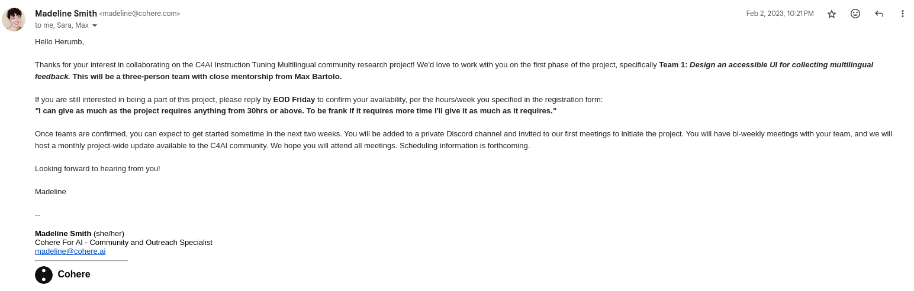
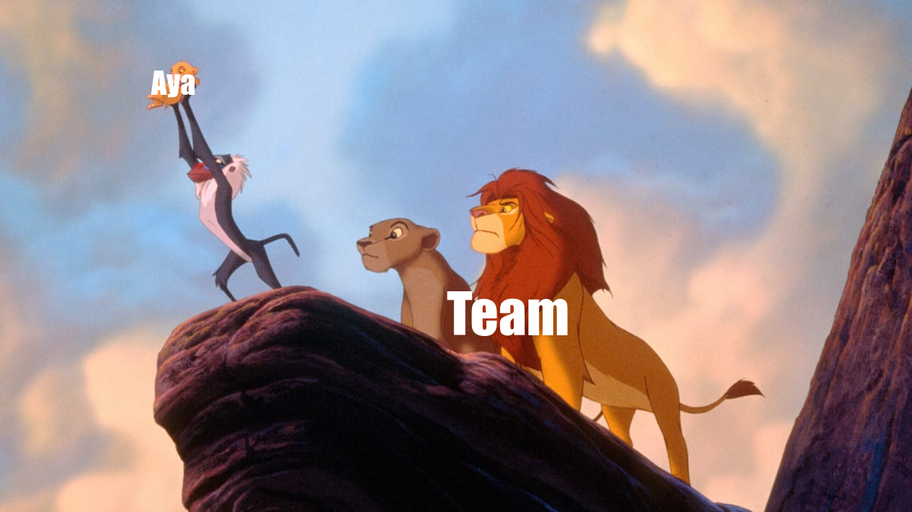

> *I don't think anyone is born knowing the reason why they're here.*
>
> *It's just something you have to find as you go along.*
>
> **-Tohru Honda**

Well well, isn't this something we've always wondered about? Thinking about the impact that any decision that you are taking in the present will have have in future, is it something that we can even do? Anyways, that went too philosophical but I think that's how this blog will be too, Why? **Aya is going to ACL LFGG** 🚀🚀

So I thought maybe I should tell people about my experience with the project, interactions, and learnings from it. To be honestly, these are possible notes for future Herumb because I know most people won't even read it lol. But regardless of that, let's start the story that became **The Aya Project**.

## Selection Arc: The Beginning and Before

I'm not really sure how to write this blog and it's quite possible it'll be quite raw but let's start from the absolute this beginning. So I joined Cohere for AI when I heard about their Research Scholars Program, what happened then is a different story altogether. But got into C4AI and starting hanging around as a silent listener in channels at first and then became a lead at the BIRDS program.

Around January of 2023, the announcement of a large scale collaborative project called "Instruct Multilingual Project". I know right it wasn't always called Aya. There were openings in three team:

* **Team 1:** UI Team
* **Team 2:** Model Training Team
* **Team 3:** Data Annotation Team

Like all the other projects/folks I reached out for collaboration I was expecting to not hear back for this project. I still applied because you miss all the shots you don't take and hoped I'll get into **Team 2** because well that's what I applied for.

I did mention in the form that I have some experience in ReactJS and while it was quite bare minimum I could code a webpage for a given design. Not picture perfect of course but good enough I'll say. You must be wondering why I'm telling you this, well you see I was selected for **Team 1** and it was bittersweet to be honest. 

I was happy I was selected for something and I was sad that it wasn't **Team 2**. I was sad for 3 seconds until I saw [Max Bartolo]() would be supervising this team. I was quite happy to see this. I was still confused about everything but after it giving it a not so deep thought I accepted the offer. You remember the start of this blog right? 

> *Thinking about the impact that any decision that you are taking in the present will have have in future, is it something that we can even do?*

I did have questions: Will I learn? Will it take me closer to my goal? I had thousand question of how this'll effect my future path but I had answer to none of those, all I knew was that in future I might do a lot of model training or project of "my domain" but this might be my only chance at working on a "real" Web Development Project.

Later this became one of my best decisions that I ever took.

## Pre-Release Arc: The Joy of Building

After a short while it was revealed that [Sara Hooker]() would be supervising this team along with [Sebastian Gehrmann]() and [Max Bartolo](). These are people that I've just seen as authors in arxiv pages and to actually work with them, I realised I'll definitely would learn a lot from this project. Since I didn't know React concretly I devoted my time learning all about it before we started the project.

We had our first meeting with them and all the team members: [Freddie Vargus]() and [Oshan Ivantha](). This was the first of many weekly meetings that we'll have later on. I was extremely nervous and one thing you should know about me is that I sound really serious when I speak in English. Which is not good because I'm never serious and it's hard to get that sarcastic tone in English 😭.

Anyway we did introductions and I don't know why I thought that showing off my pen collection is a good idea. I do not know why I did it, I thought it'll be funny but maybe it wasn't or maybe it was 🤔. Anyhow, after this call we had our first task of how to implement this UI and getting a design ready for this UI.

This was a new experience for me because we have to keep users in mind and understand what would encourage them to contribute more. Design details that previously seemed small now seemed to contribute to better engagement. It was a refreshing experience and one that I really enjoyed. How can we gamify this? How to add a sense of incentive? Every question that I'd have neglected before, now seemed important.

I learned about Figma and learned the basics of using it, I created a very scrappy design that many designers would hate but I loved it. As a programmer we often focus on implementing ideas or ideating on a very technical level. Thinking about users and what helps a user stick is not something that many of use get a chance to ponder on.

It was a fun and humbling experience in many sense, one that I'm glad I was able to experience.

## Internal Feedback Arc: The Art of Iteration

After we had a design that we could implement it was time to...implement. We started implementing the design and started iterating design on the go that we felt would improve user experience. Iterating on feedback is something I've personally never had a chance to do at that time, this was surprisingly weird because each feedback felt like I'm doing something wrong.

This is another thing that I learned, that feedbacks on product are not always associated to your skill set. I know it seems obvious but when faced with it's a bit different. You know the weirdest thing that I still regret doing are using Chakra UI and not using NextJS. If I am selected for next phase for Aya I'm definitely using NextJS!!

Once we had a MVP ready we were ready we released Aya for an internally to C4AI Community and that's when we had to iterate on user feedback. Let me tell you something people, feedbacks from team is one thing because they know the product and they understand how to use it so those feedbacks are not too different. But user feedbacks is where the gold lies, that's the real test and one that's tough to pass.

To put it in perpective we redid the whole design of the web page purely based on user feedback. I understood that product is much like a package except you don't have any documentation on how to use that product. So, you need to incorporate these elements, hints or walkthroughs in the design. The first draft of this was extremely clunky, but we got some external help from a UI designer and viola we had a great UI implemented!

This was also the time we found the name of this project and it came to be known as "Aya".

## Release Arc: Focusing on what Matters

Once we were done with the internal release it was time to open the flood gates and release it for the world to see. The feedbacks started coming and so did the bugs, and we kept iterating on that. Initially we had two annotations tasks:

* Task 1: Editing the Prompt-Completion Pair
* Task 2: Creating new Prompt-Completion Pair

As the data started being annotated, we knew that we need to incorporate a sense of accomplishment to drive interest in users. We had a psuedo rating system yes but it wasn't out there. This is why we introduced a leaderboard and the response was crazy!! People were now competing for the leaderboard, even I got excited for it!! People now were compete with the biggest incentive known to mankind...**Swags**!!

It was a fulfilling experience to ship this and see it being used by the people. This did drive user interest, however we had a realization. How do we review these edits? If someone makes minor edits for a rank push in leaderboard that's not a good edit is it? So we introduced **Task 3: Review the Annotations** (created by [Farhan]()) and **Aya Score**. Leaderboard points were only used to be about how many time you pushed the submit button but with Aya Score we incorporated quality of edits into picture too!

With this addition we saw an addition in the quality of edits too, boy was that a relief. Over next months we iterated on designs by adding elements like modals, mobile design, adding settings pages, Google SSO etc. All based on the feedback from user, these seem like small things but they improve the experience so much. For example, if Discord is banned for a certain user group something like Google SSO would be a lifesaver or during internal release we got a feed back to improve web design because certain demographic of annotators relied on mobile during previous experiments.

Things and feature that I always felt like a Quality of Life improvement were extremely important!! This might be cliched for many but it was a relisation that changed how I thought about not just products but also stuff like libraries or even visuals for a C4AI session.

## Paper Writing Arc: The Last Mile

Now after all the hardwork by the annotators and team, it was time to give Aya back to the world and share our findings. I'll be honest paper writing is not my favorite task, they don't have meme and the tone is very robotic but I gave it a shot and honestly I think I did pretty bad. I don't think it was the tone but more about how I explained what I did.

So, I started reading a bit about how to write a research paper and the more I read the more I was confused about it. I'll tell you my opinion on papers, I think the language itself seems targeted for a specific group or purpose. I think lack of memes make them hard to stick. Everything I learning in Aya seemed to be unimportant here. That's when I thought, **Why can't research papers be more fun?**

I understand why they are the way they are, crisp and to the point. But why can't the language be a bit more fluid and easy to read? Why can't a paper be written in a manner that is understood by anyone who knows english? Do we want to document what we learned or doc we wanna teach? There is a difference.

While this phase was a bit harder than the rest it helped me understand the kind of researcher I want to be and kind of paper I want to write. The tougher part was getting the numbers for the paper, why? You see I have a love-hate relationship with database stuff and my SQL is not the best...I'm more of a Pandas/Polars guy. But I did get to learn this too!

Once the paper was published, I treated myself with a cold glass of water and a stress free 12 hrs of sleep with bittersweet dreams with happiness of completion and sadness of the end of a long journey.

## After Aya: Reflections and Learnings

After that we applied for ACL and I wasn't much involved in this process. Do I regret that? Kinda, I'm not much for conferences to be honest but I wonder what I could've learnt from it. Anyways, that's how Aya went on and I'm pretty sure I might've missed some details but I tried my best!

Aya was an extremely rich and different learning experience for me that's kinda hard to define to be honest but if I have to compile a list of learnings it'll be:

* **Learning begins with unlearning:** It's easy to learn something you know but to give up on what you have learned and relearn it is tough. All the stuff that you think you know is not absolute and it's not meant to be, as you grow you gainer a different perspective on different stuff. Projects like these do the same, they provide you perspective you didn't have before and it's your duty to and it's your duty to unlearn and relearn. 

* **Be Stupid:** Whenever I asked for help that my teammate so patiently helped me with I always made sure to not add my take or thought to it unnecessarily. If you ask for help be sensible but shameless at teh same time, give up what you know and learn to learn from others. Asking for help is something I suck at and probably something I got better at even if only slightly.

* **Feedbacks are everything:** This is something I've heard a lot but never truly understood until Aya. Feedbacks are what makes a good product great, to directly hear what your users want instead of guessing what they what. What more could you ask for!!

* **Details are important:** There are the things that might seem small small to you but they make a huge difference for other. Taking every user's needs into considerations and incoporating them might be a more important job than feature stuffing.

* **Teach don't Document:** This is something that I learned from paper writing. Documentation is about what/how you did, teaching is about why you did it. Teaching someone why you did what you did in a manner understood by everyone is what research is all about for me.

* **Research is fun:** I know this might sound cliched but research is fun. It's fun to learn new things, to experiment and to try new things. It's not just model training, evaluations and fancy stuff. Anything that helps progress the field is research, even if requires you to work on stuff "out of your domain". Leave the tags aside work on anything that seems fun and importants. Domains and niches are good but don't let them be your limitation because above anything you are a programmer with a passion to code. So you do that.

## From Me to You

Whew, that might be the fastest I've written anything. Honestly it felt really good to write it and get a chance to reflect back on how things went. Aya was a great experience for me and quite a turning point as well. Some decision change your outlook towards something, some decisions change your life and some decisions change you as a person. Well, Aya and C4AI in general seemed to have don that for me. I'll say this before putting my fingers off the keyboard, if you get a chance to work on something new and you think you'll learn...JUST DO IT!!!